# Projektwoche I - SwiftUI - Rezepte App
 
 ## Feature 1: Login Screen

    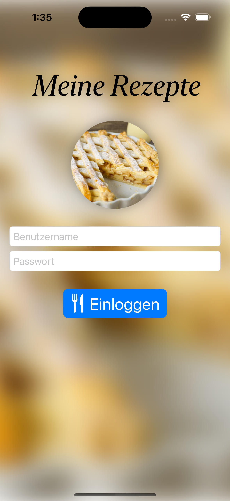
    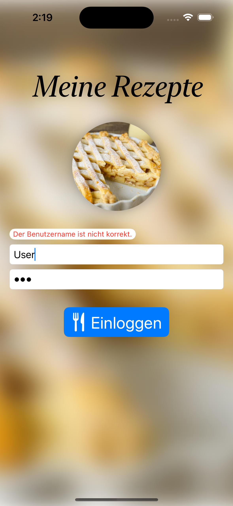
    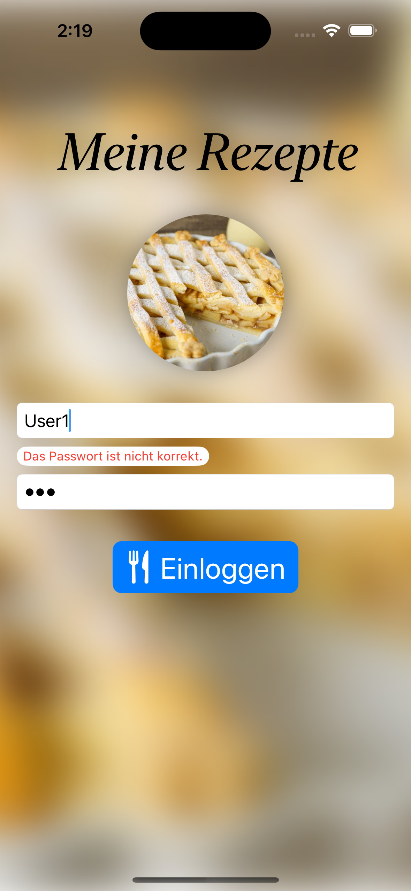

## Feature 2 - Liste der Rezepte

 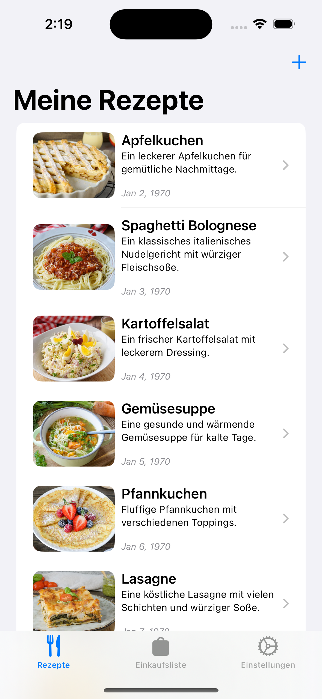
    
    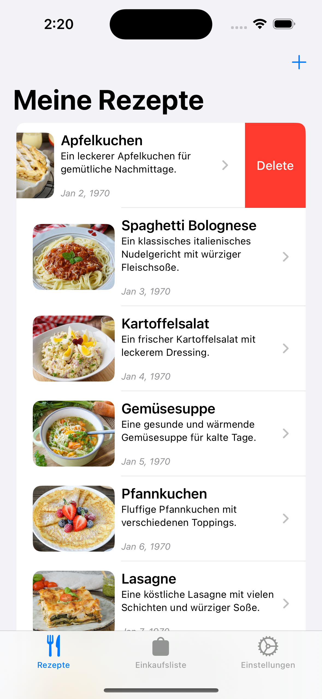
    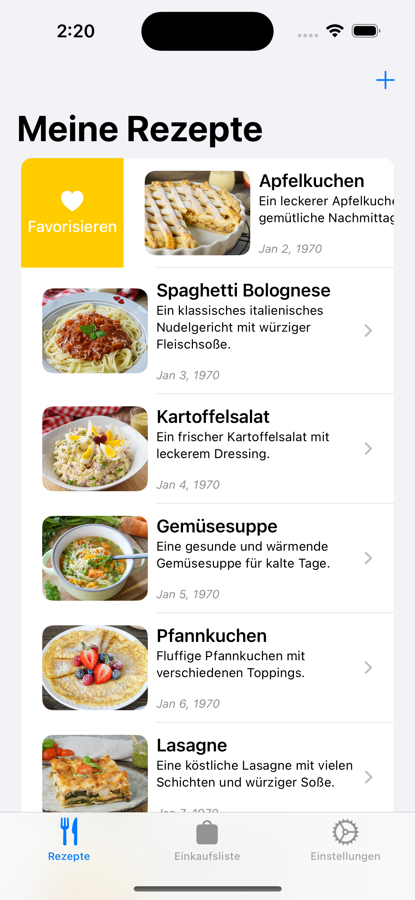
    
    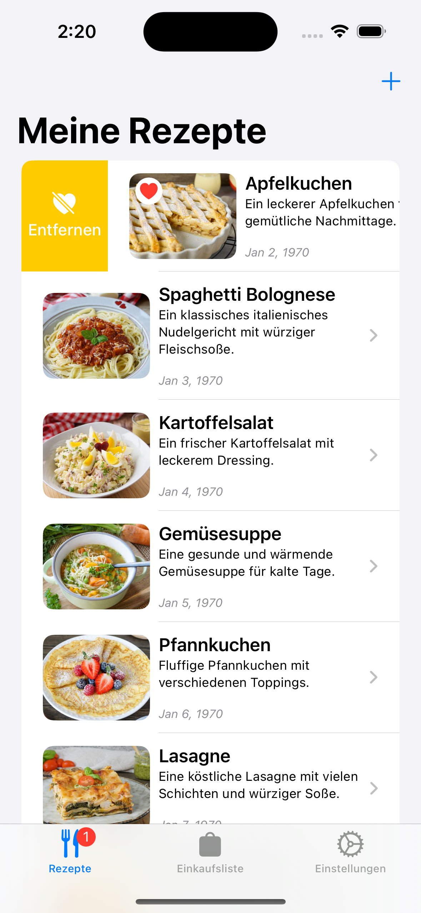

## Feature 3 - Rezept Detailansicht

 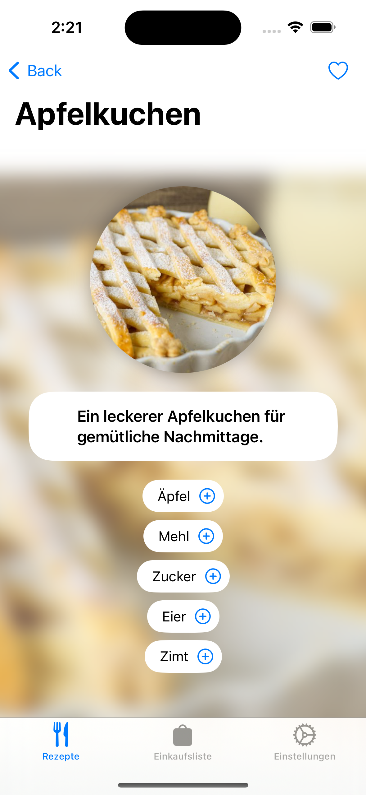
    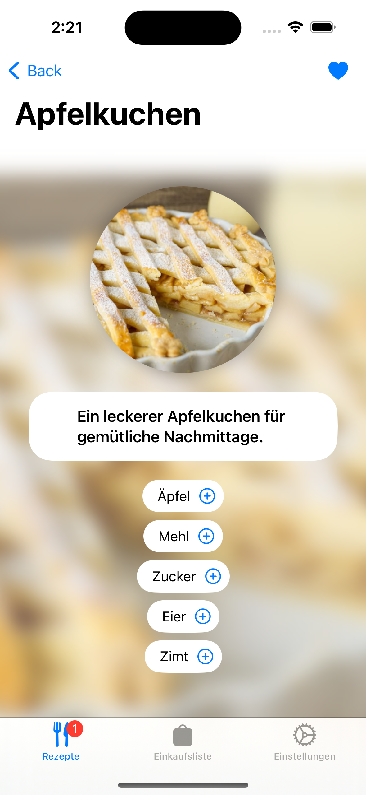
    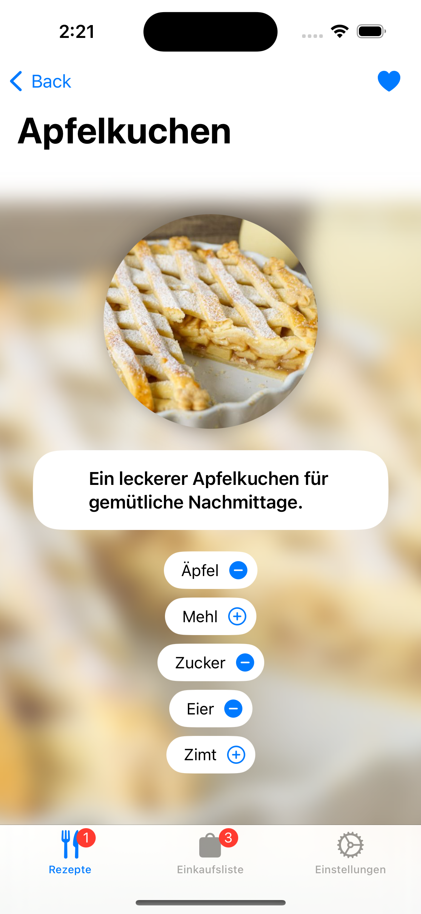

## Feature 4 - Neues Rezept erstellen

    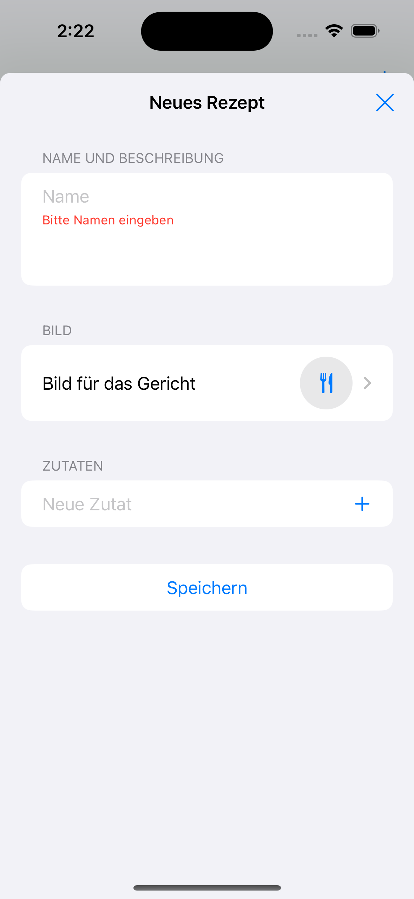
    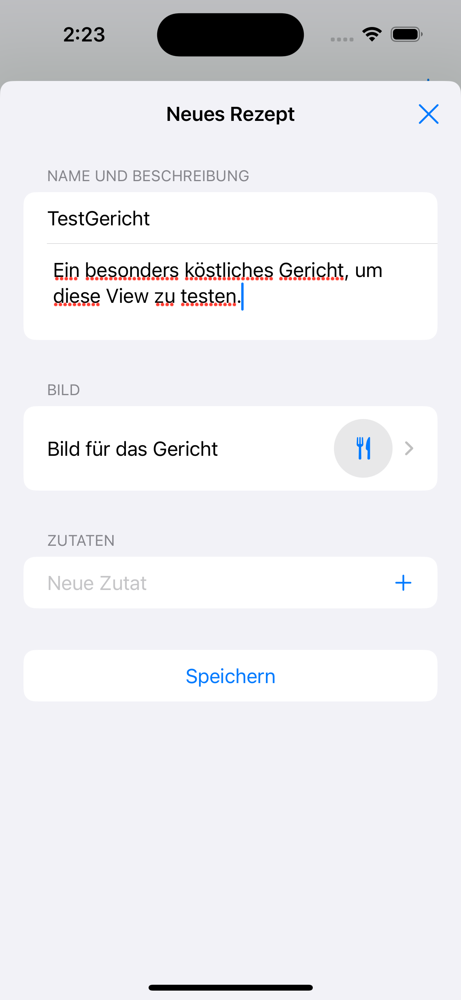
    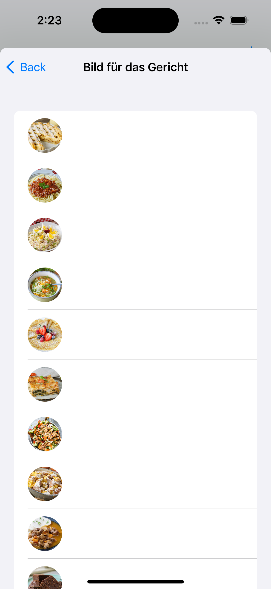
    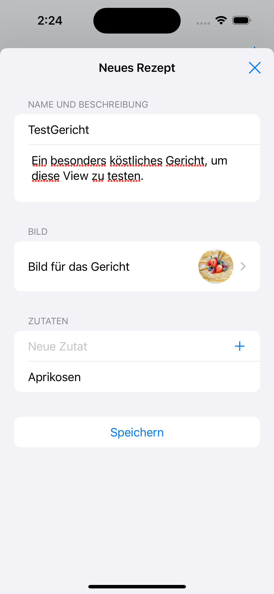
    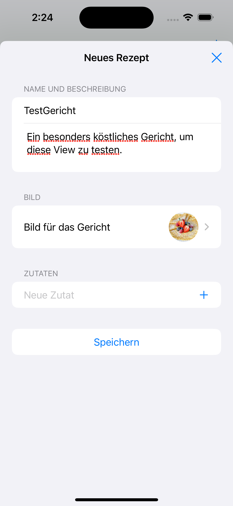
    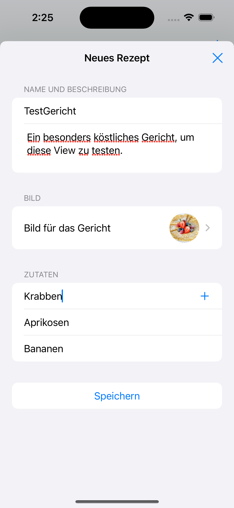

## Feature 5 - Zutaten-Liste und Einstellungen

    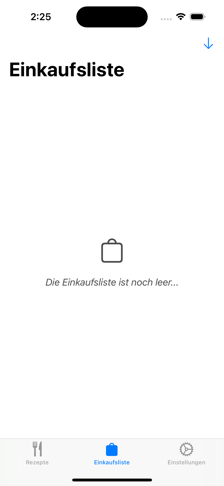
    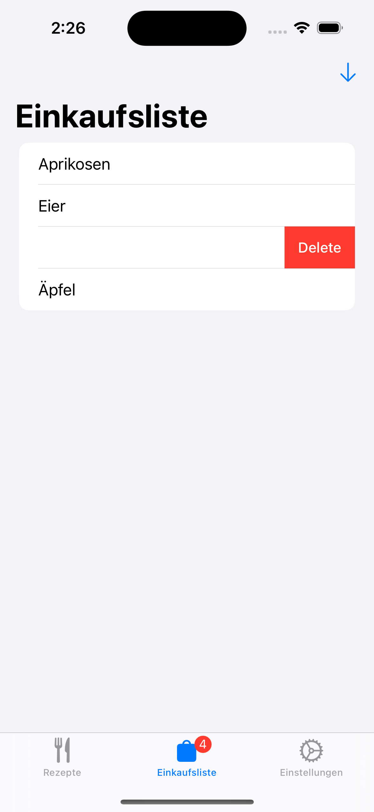
 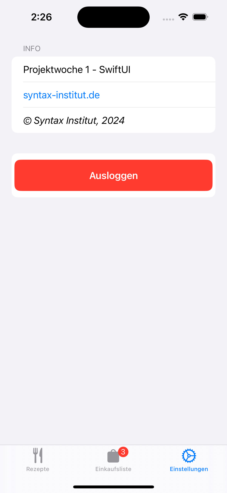

